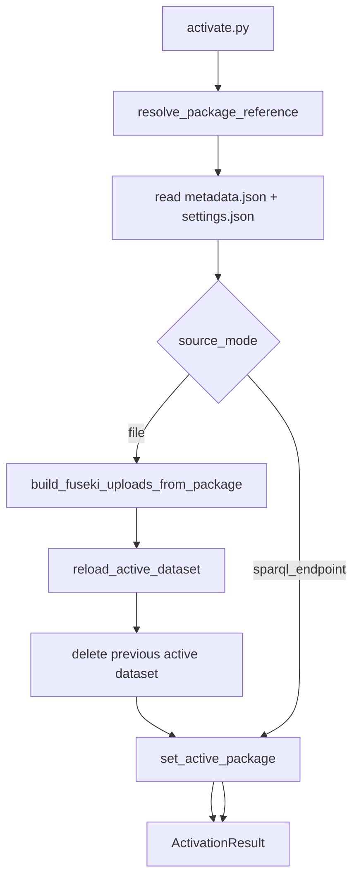

# Activation Flow

Activation is the explicit operation for switching the active package. For local file packages, it reloads the package into the managed Fuseki server.

## Code Map

| Step | Function / Module |
|---|---|
| CLI argument handling | `activate.py::parse_args`, `activate.py::main` |
| Top-level activation | `activate_package()` in `app/domain/ontology/package_activation.py` |
| Resolve package name/path | `resolve_package_reference()` in `package_activation.py` |
| Collect local RDF uploads | `build_fuseki_uploads_from_package()` in `package_activation.py` |
| Recreate local Fuseki dataset | `FusekiService.reload_active_dataset()` in `app/clients/fuseki.py` |
| Delete previous dataset | `FusekiService.delete_dataset()` in `app/clients/fuseki.py` |
| Write active pointer | `set_active_package()` in `app/domain/package.py` |

## Invariants

- Only one local managed Fuseki dataset should remain active.
- File package activation always reloads from package artifacts; it does not trust existing Fuseki state.
- SPARQL endpoint packages are externally managed, so activation only changes the active package pointer.
- `query.py` does not activate packages.
