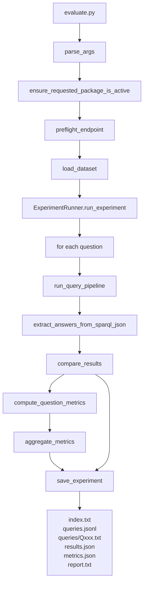

# Evaluation Flow

Evaluation runs a dataset of natural-language questions against the active package, compares generated answers to gold answers, aggregates metrics, and writes self-contained evaluation logs.



## Code Map

| Step | Function / Module |
|---|---|
| Root CLI wrapper | `evaluate.py::main` |
| CLI parsing and orchestration | `parse_args()`, `run_from_cli()` in `evaluation/experiment_runner.py` |
| Active package assertion | `ensure_requested_package_is_active()` in `experiment_runner.py` |
| Endpoint preflight | `preflight_endpoint()` in `experiment_runner.py` |
| Dataset schema | `EvaluationDataset`, `EvaluationQuestion` in `evaluation/dataset_schema.py` |
| Per-question execution | `ExperimentRunner._run_single_question()` in `experiment_runner.py` |
| Runtime query pipeline | `run_query_pipeline()` in `app/domain/runtime/pipeline.py` |
| Answer extraction | `extract_answers_from_sparql_json()` in `experiment_runner.py` |
| Answer comparison | `compare_results()` in `evaluation/answer_comparison.py` |
| Metrics | `compute_question_metrics()`, `aggregate_metrics()` in `evaluation/metrics.py` |
| Output writing | `save_experiment()`, `write_evaluation_query_logs()` in `experiment_runner.py` |

## Evaluation Outputs

```text
ontology_packages/<package>/evaluation/<run>/
  index.txt
  report.txt
  metrics.json
  results.json
  queries.jsonl
  queries/
    Q001.txt
    Q002.txt
```

## Invariants

- Evaluation does not activate packages.
- The requested package must already be active.
- Endpoint preflight runs before timed question execution.
- Missing `gold_answers` questions are run but marked `missing_gold` / unscored.
- Unscored questions count toward operational metrics, not correctness metrics.
- `--k` controls retrieval top-k for the underlying query pipeline.
