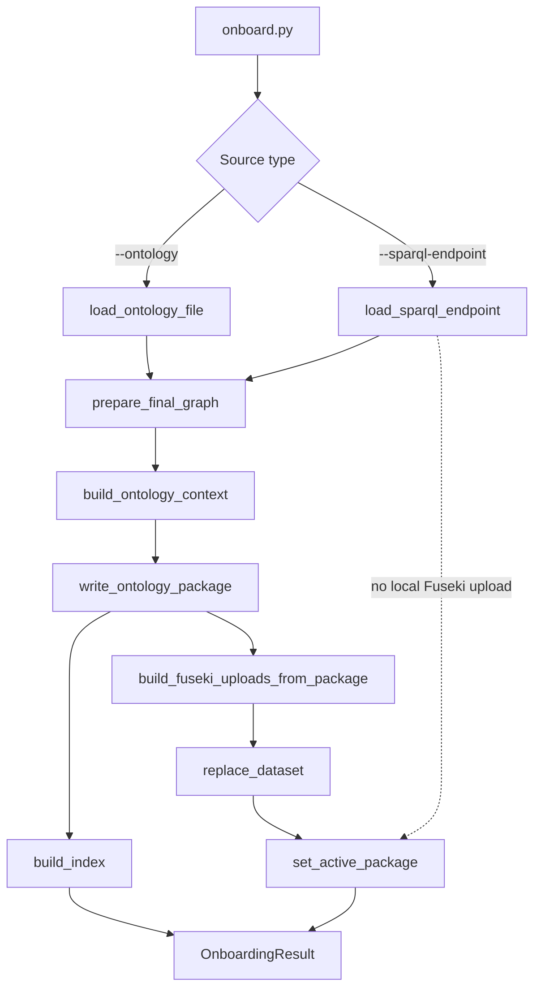

# Onboarding Flow

Onboarding turns an ontology source into a reusable package. For local ontology files, it also uploads the package data to Fuseki and marks the package active.



## Code Map

| Step | Function / Module |
|---|---|
| CLI argument handling | `onboard.py::parse_args`, `onboard.py::main` |
| Top-level file workflow | `onboard_ontology_file()` in `app/domain/ontology/onboarding_workflow.py` |
| Top-level endpoint workflow | `onboard_sparql_endpoint()` in `app/domain/ontology/onboarding_workflow.py` |
| Load ontology file | `load_ontology_file()` in `source_loader.py` |
| Load external endpoint graph | `load_sparql_endpoint()` in `source_loader.py` |
| Prepare final graph | `prepare_final_graph()` in `graph_preparation.py` |
| Build context JSON | `build_ontology_context()` in `ontology_context.py` |
| Write package artifacts | `write_ontology_package()` in `package_writer.py` |
| Build chunks and FAISS index | `build_index()` in `app/domain/rag/build_index.py` |
| Upload local package data | `FusekiService.replace_dataset()` in `app/clients/fuseki.py` |
| Mark active package | `set_active_package()` in `app/domain/package.py` |

## Package Outputs

```text
ontology_packages/<package>/
  metadata.json
  ontology_context.json
  settings.json
  ontology/source.*
  ontology/schemas/
  chunks/chunks.json
  chunks/index.faiss
  logs/onboard.log
```

## Invariants

- File onboarding creates a new package and a new managed Fuseki dataset.
- File onboarding activates the new package after upload succeeds.
- Endpoint onboarding creates a package but does not upload to managed Fuseki.
- Package directories are durable artifacts; Fuseki is reloadable runtime state.
