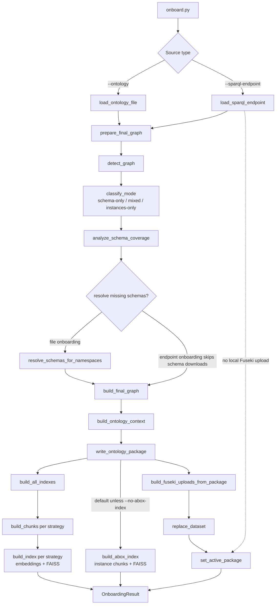

# Onboarding Flow

Onboarding turns an ontology source into a reusable package. For local ontology files, it also uploads the package data to Fuseki and marks the package active.


```mermaid
flowchart TD
    cli[onboard.py]
    source{Source type}
    load_file[load_ontology_file]
    load_endpoint[load_sparql_endpoint]
    prepare[prepare_final_graph]
    detect[detect_graph]
    mode[classify_mode\nschema-only / mixed / instances-only]
    coverage[analyze_schema_coverage]
    resolve{resolve missing schemas?}
    schemas[resolve_schemas_for_namespaces]
    merge[build_final_graph]
    context[build_ontology_context]
    write[write_ontology_package]
    build_all[build_all_indexes]
    chunks[build_chunks per strategy]
    index[build_index per strategy\nembeddings + FAISS]
    abox[build_abox_index\ninstance chunks + FAISS]
    uploads[build_fuseki_uploads_from_package]
    fuseki[replace_dataset]
    active[set_active_package]
    result[OnboardingResult]

    cli --> source
    source -->|--ontology| load_file
    source -->|--sparql-endpoint| load_endpoint
    load_file --> prepare
    load_endpoint --> prepare
    prepare --> detect --> mode --> coverage --> resolve
    resolve -->|file onboarding| schemas --> merge
    resolve -->|endpoint onboarding skips schema downloads| merge
    merge --> context
    context --> write
    write --> build_all --> chunks --> index
    write -->|default unless --no-abox-index| abox
    index --> result
    abox --> result

    write --> uploads
    uploads --> fuseki
    fuseki --> active
    active --> result

    load_endpoint -. no local Fuseki upload .-> active
```

## Code Map

| Step | Function / Module |
|---|---|
| CLI argument handling | `onboard.py::parse_args`, `onboard.py::main` |
| Top-level file workflow | `onboard_ontology_file()` in `app/domain/ontology/onboarding_workflow.py` |
| Top-level endpoint workflow | `onboard_sparql_endpoint()` in `app/domain/ontology/onboarding_workflow.py` |
| Load ontology file | `load_ontology_file()` in `source_loader.py` |
| Load external endpoint graph | `load_sparql_endpoint()` in `source_loader.py` |
| Prepare final graph | `prepare_final_graph()` in `graph_preparation.py` |
| Detect graph contents | `detect_graph()` in `graph_preparation.py` |
| Classify ontology mode | `classify_mode()` in `graph_preparation.py` |
| Check schema coverage | `analyze_schema_coverage()` in `graph_preparation.py` |
| Resolve missing schemas | `resolve_schemas_for_namespaces()` in `graph_preparation.py` |
| Merge resolved schemas | `build_final_graph()` in `graph_preparation.py` |
| Build context JSON | `build_ontology_context()` in `ontology_context.py` |
| Write package artifacts | `write_ontology_package()` in `package_writer.py` |
| Build chunks | `build_chunks()` in `app/domain/rag/chunking.py` |
| Build every package index | `build_all_indexes()` in `app/domain/rag/build_index.py` |
| Build embeddings and one FAISS index | `build_index()` in `app/domain/rag/build_index.py` |
| Build ABox chunks and index | `build_abox_index()` in `app/domain/rag/build_abox_index.py` |
| Upload local package data | `FusekiService.replace_dataset()` in `app/clients/fuseki.py` |
| Mark active package | `set_active_package()` in `app/domain/package.py` |

## Package Outputs

```text
ontology_packages/<package>/
  metadata.json
  ontology_context.json
  settings.json
  ontology/source.*
  ontology/schemas/
  indexes/class_based/chunks.json
  indexes/class_based/index.faiss
  indexes/property_based/chunks.json
  indexes/property_based/index.faiss
  indexes/composite/chunks.json
  indexes/composite/index.faiss
  indexes/abox/chunks.json
  indexes/abox/index.faiss
  logs/onboard.log
```

## Invariants

- File onboarding creates a new package and a new managed Fuseki dataset.
- File onboarding activates the new package after upload succeeds.
- Endpoint onboarding creates a package but does not upload to managed Fuseki.
- Endpoint onboarding skips external schema downloads by calling `prepare_final_graph(..., resolve_missing_schemas=False)`.
- Onboarding builds all supported retrieval index strategies into `indexes/<strategy>/`.
- Onboarding builds `indexes/abox/` by default unless `--no-abox-index` is passed.
- Model, schema retrieval top-k, ABox retrieval use, ABox top-k, chunking strategy, and correction attempts are not package settings; runtime and evaluation resolve them from explicit inputs or `app/core/config.py`.
- The ontology mode and schema coverage are saved into `metadata.json`.
- Package directories are durable artifacts; Fuseki is reloadable runtime state.
