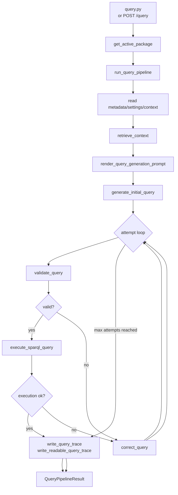

# Query Flow

Querying starts from the active package, retrieves ontology context, asks the LLM for SPARQL, validates it, executes it, and optionally asks for corrections.



## Code Map

| Step | Function / Module |
|---|---|
| CLI query entrypoint | `query.py::main` |
| API query entrypoint | `run_query()` in `app/api/routes/query.py` |
| Active package lookup | `get_active_package()` in `app/domain/package.py` |
| Runtime orchestration | `run_query_pipeline()` in `app/domain/runtime/pipeline.py` |
| Attempt loop | `run_query_attempts()` in `pipeline.py` |
| Retrieve chunks | `retrieve_context()` in `app/domain/rag/retrieve_context.py` |
| Render initial prompt | `render_query_generation_prompt()` in `prompt_renderer.py` |
| Generate initial SPARQL | `generate_initial_query()` in `query_generation.py` |
| Validate SPARQL | `validate_query()` in `validation.py` |
| Execute SPARQL | `execute_sparql_query()` in `sparql_execution.py` |
| Correct failed query | `correct_query()` in `query_correction.py` |
| Write traces | `write_query_trace()`, `write_readable_query_trace()` in `query_trace.py` |

## Query Logs

```text
ontology_packages/<package>/logs/
  query.log
  query-latest.txt
  query-runs/<run-id>.txt
```

## Invariants

- `query.py` always uses the active package.
- `query.py` has no package argument and no endpoint override.
- Candidate SPARQL is executed only after validation passes.
- Validation or execution failures can trigger correction attempts.
- `--k` is retrieval top-k, not correction iterations.
