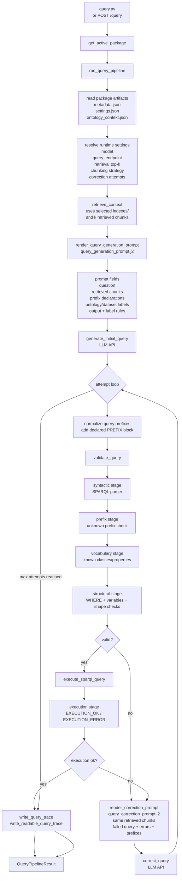

# Query Flow

Querying starts from the active package, retrieves ontology context, asks the LLM for SPARQL, validates it, executes it, and optionally asks for corrections.



## Code Map

| Step | Function / Module |
|---|---|
| CLI query entrypoint | `query.py::main` |
| API query entrypoint | `run_query()` in `app/api/routes/query.py` |
| Active package lookup | `get_active_package()` in `app/domain/package.py` |
| Runtime orchestration | `run_query_pipeline()` in `app/domain/runtime/pipeline.py` |
| Attempt loop | `run_query_attempts()` in `pipeline.py` |
| Runtime settings | `settings.json`, `app/core/config.py`, `_string_setting()`, `_int_setting()` in `pipeline.py` |
| Retrieve chunks from selected index | `retrieve_context(..., k=effective_k, chunking=effective_chunking)` in `app/domain/rag/retrieve_context.py` |
| Render initial prompt | `render_query_generation_prompt()` in `prompt_renderer.py` |
| Initial prompt template | `app/domain/runtime/templates/query_generation_prompt.j2` |
| Generate initial SPARQL | `generate_initial_query()` in `query_generation.py` |
| Normalize prefixes | `validate_query()` calls `_normalize_query()` in `validation.py` |
| Syntactic validation | `_syntactic_validation()` in `validation.py` |
| Prefix validation | `_prefix_validation()` in `validation.py` |
| Vocabulary validation | `_vocabulary_validation()` in `validation.py` |
| Structural validation | `_structural_validation()` in `validation.py` |
| Execute SPARQL | `execute_sparql_query()` in `sparql_execution.py` |
| Execution trace stage | `execution_stage_result()` in `sparql_execution.py` |
| Correct failed query | `correct_query()` in `query_correction.py` |
| Correction prompt template | `app/domain/runtime/templates/query_correction_prompt.j2` |
| Write traces | `write_query_trace()`, `write_readable_query_trace()` in `query_trace.py` |

## Prompt Inputs

The initial generation prompt contains:

- user question
- retrieved ontology chunks, controlled by retrieval top-k and selected chunking strategy
- ontology label and dataset label, explicitly marked as labels and not prefixes
- auto-generated prefix declarations from `ontology_context.json`
- prefix usage rules
- result-shape rules, including label preference for entity answers
- output format rules

The correction prompt contains:

- original question
- same retrieved chunks used in the initial generation prompt
- failed query
- validation or execution errors
- available prefix declarations
- prefix and result-shape rules

## Validation And Execution Stages

```text
formal validation:
  1. syntactic   -> SPARQL parser
  2. prefix      -> rejects undeclared prefixes
  3. vocabulary  -> checks referenced ontology classes/properties
  4. structural  -> WHERE, projected variables, broad query shape

endpoint execution:
  5. execution   -> EXECUTION_OK or EXECUTION_ERROR
```

## Query Logs

```text
ontology_packages/<package>/logs/
  query.log
  query-latest.txt
  query-runs/<run-id>.txt
```

## Invariants

- `query.py` always uses the active package.
- `query.py` has no package argument and no endpoint override.
- `query.py --chunking` selects one prebuilt package index; it does not rebuild indexes.
- Candidate SPARQL is executed only after validation passes.
- Validation or execution failures can trigger correction attempts.
- `--k` is retrieval top-k, not correction iterations.
- `--corrections` is the maximum number of correction loop attempts for that query.
