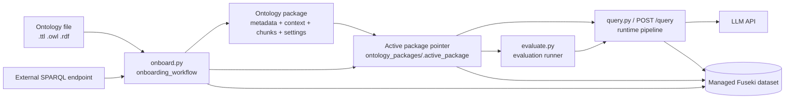

# System Overview

This diagram shows the main runtime surfaces of the project and how ontology packages connect onboarding, activation, querying, and evaluation.

## Code Map

| Area | Main entrypoint | Main domain modules |
|---|---|---|
| Onboarding | `onboard.py` | `app/domain/ontology/onboarding_workflow.py` |
| Activation | `activate.py` | `app/domain/ontology/package_activation.py` |
| Querying | `query.py`, `app/api/routes/query.py` | `app/domain/runtime/pipeline.py` |
| Evaluation | `evaluate.py` | `evaluation/experiment_runner.py` |
| Fuseki integration | n/a | `app/clients/fuseki.py` |
| LLM integration | n/a | `app/clients/llm.py` |
| Package state | n/a | `app/domain/package.py` |

## Invariants

- `query.py` always queries the active package.
- `/query` always queries the active package.
- For local file packages, activation is what guarantees the managed Fuseki dataset matches the package.
- Evaluation names a package, but only to verify it is already active.
