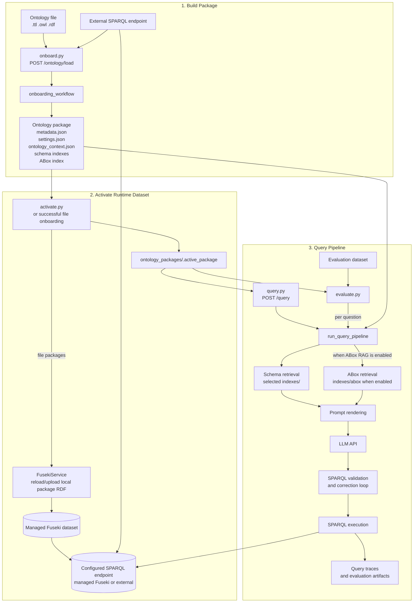

# System Overview

The project has three main phases: package creation, package activation, and runtime use. Querying and evaluation both call the same runtime pipeline; evaluation does not call `query.py`.

```mermaid
flowchart TD
    subgraph Build["1. Build Package"]
        source_file[Ontology file\n.ttl .owl .rdf]
        source_endpoint[External SPARQL endpoint]
        onboard_entry[onboard.py\nPOST /ontology/load]
        onboarding[onboarding_workflow]
        package[Ontology package\nmetadata.json\nsettings.json\nontology_context.json\nschema indexes\nABox index]

        source_file --> onboard_entry
        source_endpoint --> onboard_entry
        onboard_entry --> onboarding --> package
    end

    subgraph Activate["2. Activate Runtime Dataset"]
        activate_cli[activate.py\nor successful file onboarding]
        upload[FusekiService\nreload/upload local package RDF]
        active_pointer[ontology_packages/.active_package]
        fuseki[(Managed Fuseki dataset)]
        query_endpoint[(Configured SPARQL endpoint\nmanaged Fuseki or external)]

        package --> activate_cli
        activate_cli --> active_pointer
        activate_cli -->|file packages| upload --> fuseki
        fuseki --> query_endpoint
        source_endpoint --> query_endpoint
    end

    subgraph Runtime["3. Query Pipeline"]
        query_entry[query.py\nPOST /query]
        eval_entry[evaluate.py]
        dataset[Evaluation dataset]
        pipeline[run_query_pipeline]
        rag[Schema retrieval\nselected indexes/<strategy>]
        abox[ABox retrieval\nindexes/abox when enabled]
        prompt[Prompt rendering]
        llm[LLM API]
        validate[SPARQL validation\nand correction loop]
        execute[SPARQL execution]
        traces[Query traces\nand evaluation artifacts]

        active_pointer --> query_entry --> pipeline
        active_pointer --> eval_entry
        dataset --> eval_entry
        eval_entry -->|per question| pipeline
        package --> pipeline
        pipeline --> rag --> prompt
        pipeline -->|when ABox RAG is enabled| abox --> prompt
        prompt --> llm --> validate --> execute --> traces
        execute --> query_endpoint
    end
```

## Code Map

| Area | Main entrypoint | Main domain modules |
|---|---|---|
| Onboarding | `onboard.py`, `POST /ontology/load` in `app/api/routes/ontology.py` | `app/domain/ontology/onboarding_workflow.py` |
| Activation | `activate.py` | `app/domain/ontology/package_activation.py` |
| Runtime querying | `query.py`, `app/api/routes/query.py` | `app/domain/runtime/pipeline.py` |
| Evaluation | `evaluate.py` | `evaluation/experiment_runner.py` |
| Schema and ABox retrieval | n/a | `app/domain/rag/` |
| Fuseki upload/reload integration | n/a | `app/clients/fuseki.py` |
| Runtime SPARQL execution | n/a | `app/domain/runtime/sparql_execution.py` |
| LLM integration | n/a | `app/clients/llm.py` |
| Package state | n/a | `app/domain/package.py` |

## Invariants

- Onboarding creates durable package artifacts under `ontology_packages/`.
- File onboarding builds schema indexes for every chunking strategy and builds the ABox index by default.
- Activation reloads local file packages into the managed Fuseki dataset and updates `.active_package`.
- `query.py` and `/query` always use the active package.
- Evaluation requires the requested package to already be active, then calls the runtime pipeline once per question.
- Runtime settings such as model, chunking, schema top-k, ABox use, ABox top-k, and correction attempts come from explicit caller overrides or `app/core/config.py`.
